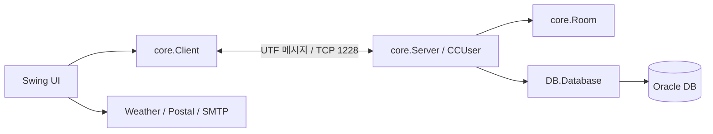

# OmokGame 기술 보고서

## 1. 검토 목적

기존 세 후보 중 기능이 가장 풍부한 C 프로젝트를 GitHub 기준 소스로 정리했다. 검토는 실제 Java 소스, SQL, 리소스, 빌드 파일과 컴파일 결과를 기준으로 수행했다.

## 2. 프로젝트 개요

OmokGame은 Java Swing 데스크톱 클라이언트와 TCP 멀티스레드 서버로 구성된다. Oracle DB는 회원, 전적, 채팅을 저장한다. 주요 외부 연동은 SMTP 임시 비밀번호 발송, OpenWeather, 우편번호 API다.

## 3. 아키텍처

- `core.Server`: 접속 수락, 사용자 세션, 프로토콜 라우팅
- `core.Room`: 플레이어·관전자, 보드와 수 기록, 상태 전파
- `core.Client`: 서버 연결과 클라이언트 메시지 처리
- `DB.Database`: 사용자·전적·채팅 SQL
- `ui`: 로그인, 게임, 랭킹, 복기, 관리자 및 채팅 화면

현재 문자열을 `//`로 나누는 프로토콜과 대형 Server/Client 클래스는 유지보수성의 주요 한계다.

## 4. 데이터베이스와 SQL

소스에서 `Users`, `ChatMessages`, 시퀀스 `chat_message_seq` 사용을 확인했다. `DBTable`은 Users 일부 DDL을 제공하지만 전체 운영 스키마와 마이그레이션은 없다.

이번 수정에서 다음 SQL 안전성을 개선했다.

- 닉네임 랭킹 조회와 승·패 갱신을 PreparedStatement로 변경
- 동적 중복 확인 컬럼을 `id`, `nickname`, `email`, `phone`으로 제한
- 프로필 동적 UPDATE 컬럼을 허용 목록으로 제한
- 관리자 목록 조회에서 비밀번호 컬럼을 제거

남은 과제는 평문 비밀번호를 해시로 마이그레이션하고, 승패 갱신을 `SET win = win + 1` 형태의 원자적 쿼리로 단순화하며, Flyway/Liquibase로 스키마를 관리하는 것이다.

## 5. 기능 평가

| 기능 | 상태 | 비고 |
|---|---|---|
| 회원/로그인/계정 복구 | 구현 | 비밀번호 해시 필요 |
| 게임방/준비/시작 | 구현 | 상태 머신 테스트 필요 |
| 착수/승패 | 구현 | 서버 검증과 규칙 테스트 필요 |
| 관전자 | 구현 | 상태/수 기록 동기화 포함 |
| 복기 | 구현 | 메모리 수 기록 기반 |
| 랭킹/전적 | 구현 | Oracle 쿼리 사용 |
| 개인/그룹 채팅 | 구현 | DB 채팅 기록 포함 |
| 관리자 | 구현 | 비밀번호 조회 제거됨 |
| 테스트 | 없음 | JUnit 도입 필요 |

## 6. 이번 공개 준비 작업

- DB, 관리자, SMTP, 날씨, 주소 API 비밀값을 환경 변수로 이전
- HTTPS 우편번호 API 기본 URL 적용
- 개인 다운로드, 생성 이미지, Eclipse 메타데이터, 클래스 파일, 내장 JDK를 `.gitignore`에서 제외
- Java 17 Maven 빌드와 의존성 버전 선언
- SQL Injection 가능 지점 일부 제거
- README, 환경 변수 예제, 기술·보안·개선 문서 작성

## 7. 검증

내장 JDK 17.0.10과 로컬 의존성으로 전체 `scr/**/*.java`를 컴파일했으며 성공했다. 실제 Oracle/API/SMTP 자격 증명은 안전상 제공하지 않았으므로 외부 서비스 통합 실행은 수행하지 않았다. 자동 테스트는 아직 없다.

## 8. 결론

C는 세 후보 중 Git 기준 기능 베이스로 가장 적합하다. 이번 변경으로 최초 공개에 필요한 비밀정보·불필요 파일 제외와 재현 가능한 의존성 선언을 마련했다. 다만 인증 저장 방식과 네트워크 프로토콜은 운영 수준이 아니므로 후속 보안 개선이 필요하다.

